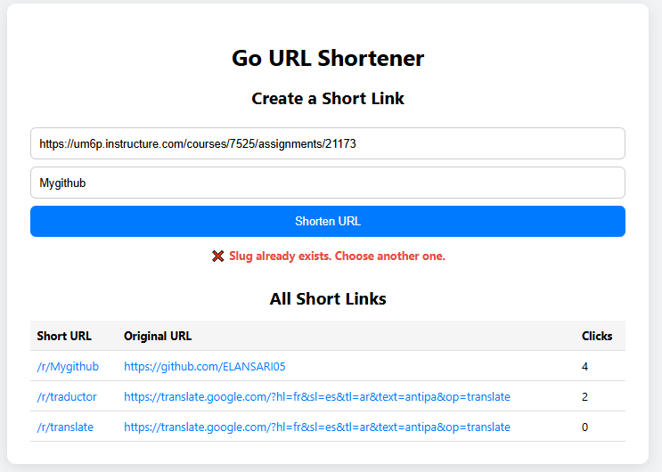

# Go URL Shortener 🔗

A simple, fast, and interactive URL shortener built with Go.

Create short URLs for long links, customize your slugs, track click statistics, and interact through a clean frontend or REST API — all stored persistently using `data.json`.

 <!-- optional screenshot -->

---

## 🚀 Features

- 🔗 **Shorten long URLs**
- ✏️ **Custom slugs** (e.g., `/r/github`)
- 📊 **Click tracking**
- 🧠 **Interactive HTML frontend**
- 🛠️ **REST API support**
- 💾 **Persistent storage** via `data.json`

---

## 📸 Demo

Try it locally:  
`http://localhost:8080`

 <!-- optional GIF or screenshot -->

---

## 🧑‍💻 How to Run Locally

### Prerequisites
- Go 1.18+
- Git

### Steps

```bash
git clone https://github.com/YOUR_USERNAME/YOUR_REPO_NAME.git
cd YOUR_REPO_NAME
go run main.go handler.go storage.go utils.go
